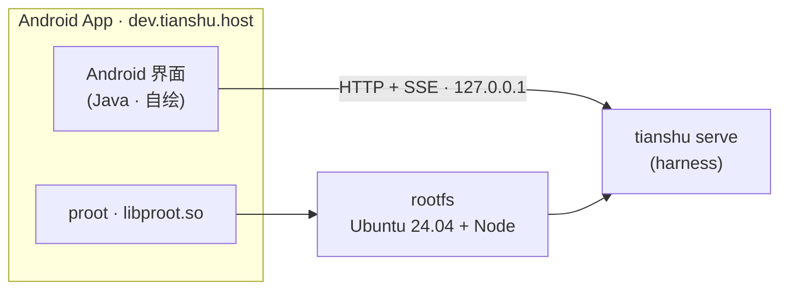

# 天枢 App · Android 客户端

> 把 [Tianshu Harness](https://github.com/huiliyi37/Tianshu-harness) 装进手机 —— **无需电脑、无需 root**，在设备本地自包含运行。

天枢 App 是一个自包含的 Android 宿主：内置一份 Linux 用户态（rootfs）与 proot，首次启动把它解压到 App 私有目录，用 proot 起一个容器，在容器里运行 `tianshu serve`；界面（原生 Java 自绘）通过本地 HTTP + SSE 与它对话。

运行时依赖的 harness 本体在上游 [`Tianshu-harness`](https://github.com/huiliyi37/Tianshu-harness)，本仓库只包含 **App 侧（宿主 + 界面）**。

## 架构



App 走四步自检：**解压 rootfs → 起 proot 容器 → 拉起 `tianshu serve` → 连接界面**。

## 前提与限制（先读）

- **本仓库不含 `rootfs.tar.xz`**（约 103 MB，解压后 600+ MB，体积过大不入库）。要跑起完整 App，需按 [`rootfs/`](rootfs/) 自行构建，或从本项目的 Releases 获取。
  - 也就是说：**直接 clone 本仓库构建不出可运行的 APK** —— 缺运行时。
- 目标架构仅 **arm64-v8a**（proot 与 rootfs 都是 aarch64）。
- 构建是**手搓链**（`aapt2 → javac → D8 → zipalign → apksigner`），不依赖 Gradle/AGP —— 因为 arm64 上 Gradle/AGP 走不通（原因见 [`android-probe/README.md`](android-probe/README.md)）。
- 构建环境是 **Android + Termux**：proot 必须用 Termux 那份（它依赖 bionic），不能从 glibc 容器里搬。

## 构建

### 环境

所需工具与获取方式（含「D8 不在 apt 里，要去 Google Maven 取 r8.jar」等坑）见 [`android-probe/README.md`](android-probe/README.md)：

```bash
apt-get install -y --no-install-recommends \
  openjdk-17-jdk-headless android-sdk-build-tools apksigner zipalign android-sdk-platform-23
```

### 1. 构建运行时 rootfs

```bash
sh rootfs/build-rootfs.sh      # → /root/rootfs-build/rootfs.tar.xz
```

需要一个 Ubuntu 24.04 aarch64 的 base layer（默认取 proot-distro 的 OCI 缓存，可用 `LAYER=` 覆盖）。

### 2. 构建 APK

```bash
sh host/build.sh               # → host/build/tianshu-host.apk
```

它会把这些一起打进 APK：`rootfs.tar.xz`（assets）、Termux 的 proot 及其依赖（`jniLibs/arm64-v8a/`）、命令目录（源在 `data/`）。产物末尾会复制一份到 `/storage/emulated/0/Download/`。

签名密钥放在 `host/.keystore/`（**不入库**）—— 保持同一把密钥，才能覆盖安装而不丢 App 私有目录里的 rootfs 与会话历史。

### App 侧纯逻辑测试

`HostTest` 覆盖宿主的纯逻辑（存储降级、续传、会话解析等），编译期需 `android.jar`：

```bash
cd host
javac -encoding UTF-8 \
  -cp "/usr/lib/android-sdk/platforms/android-23/android.jar:libs/xz-1.10.jar" \
  -d /tmp/t src/dev/tianshu/host/*.java test/dev/tianshu/host/*.java \
  && LC_ALL=C.UTF-8 java -cp "/tmp/t:libs/xz-1.10.jar" dev.tianshu.host.HostTest
```

## 运行

装好 APK 后打开即可。首次启动解压 rootfs 较慢（600+ MB 写盘）。模型 API key 在 App 的「配置天枢」页填入，由 harness 自己加密落盘 —— **密钥不随包携带、不入库**。

## 仓库结构

| 路径 | 内容 |
|---|---|
| `host/` | **App 本体**：宿主与界面（Java）、构建脚本、纯逻辑测试 |
| `rootfs/` | 运行时 rootfs 的构建脚本 |
| `android-probe/` | 手机上构建 APK 的环境事实与探针 |
| `src/` `test/` `data/` | 离线靶子：把界面纪律变成可断言的测试 |
| `scripts/` | 契约 / 路由探针 |

## 离线靶子（测试）

部分界面纪律被写成了可断言的测试 —— 答案置底、风格只改外观不改结构、UI 组件与 `/` 命令双向覆盖、WCAG 对比度护栏。四个靶子都带**反例测试**（烂色板必须红、无来源的按钮必须红 …）：

```bash
npm test                        # 靶子 1-4（离线，无需服务）
node scripts/probe-contract.mjs # 契约探针（会起一个 serve）
node scripts/probe-routes.mjs   # 候选路由打靶（串行，约 1 分钟）
```

## 许可

[Apache License 2.0](LICENSE)，与上游 Tianshu Harness 一致。
